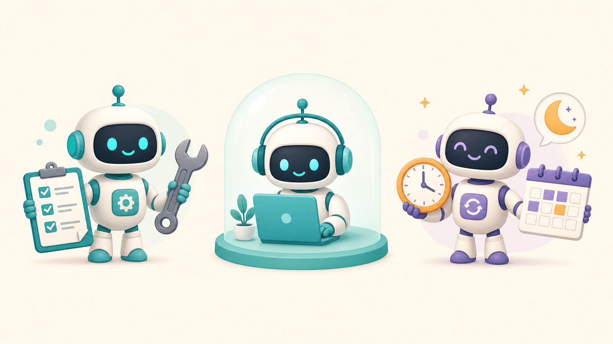

<div align="center">

# 🧠 AIOS Starter Kit


**Build your own personal Agentic OS.**

A clonable template that turns Claude Code into a thought partner that *remembers* — it
knows who you are, compounds knowledge across sessions, and grows new skills over time.

*Un sistema operativo de IA personal. Una plantilla para clonar que convierte a Claude Code
en un compañero de trabajo que **recuerda**.*

**Kit v2.2** — June 2026

</div>

---

## What is an Agentic OS? / ¿Qué es un Agentic OS?

A normal AI chat forgets everything when you close it. An **AI Operating System (AIOS)** — your personal **Agentic OS** — doesn't.

It's a folder — version-controlled, owned by you — that gives your AI assistant four things
a blank chat never has:

1. **Context** — it knows who you are and what you're working on.
2. **A knowledge wiki** — facts it has learned, written down and reused (not lost in chat history).
3. **Skills** — repeatable workflows you trigger with `/commands`.
4. **A way to grow** — builders that let it create *new* skills, agents, and automations.

You don't program it. You *talk* to it, and it writes itself into a system that gets more
useful every week.

> **Español:** Un chat normal de IA olvida todo cuando lo cierras. Un **Sistema Operativo de
> IA (AIOS)** — tu **Agentic OS** personal — no. Es una carpeta — con control de versiones, tuya — que le da a tu asistente
> cuatro cosas que un chat en blanco nunca tiene: **contexto** (sabe quién eres),
> una **wiki de conocimiento** (lo que ha aprendido, escrito y reutilizable), **skills**
> (flujos de trabajo que activas con `/comandos`), y una **forma de crecer** (constructores
> que crean nuevas skills, agentes y automatizaciones). No lo programas: hablas con él.

---

## Quickstart / Inicio rápido

You need [Claude Code](https://claude.com/claude-code) installed.

```bash
# 1. Clone the kit  /  Clona el kit
git clone https://github.com/GerardoRdz96/aios-starter-kit.git my-aios
cd my-aios

# 2. (optional) make it your own private repo  /  hazlo tu propio repo privado
rm -rf .git && git init

# 3. Arm the security guards  /  Activa los guardias de seguridad
scripts/rails-guard.sh install

# 4. Open Claude Code in the folder  /  Abre Claude Code en la carpeta
claude

# 5. Inside Claude Code, run the onboarding wizard  /  Corre el asistente de bienvenida
/onboard
```

The first time you open the folder, Claude Code reads the kit's `.claude/settings.json` and
**offers to install the whole plugin stack** (Superpowers, Context Mode, Claude Mem, Codex,
Gemini, and more — see the Power skills section below). Accept once and they're live — no
manual `/plugin` commands. (If your Claude Code version doesn't prompt, the one-time manual
commands live in [`references/power-skills.md`](references/power-skills.md).) Then
`/onboard` interviews you (about 7 short questions) and fills
in your context. That's it — you have a working AIOS. Try asking it: *"what should I focus
on this week?"*

**Security:** your personal dirs (`context/`, `knowledge/`, `decisions/`, `artifacts/`) are gitignored by default, and the guards from step 3 block accidental pushes of personal content + silent edits to governance files. Threat model and the rules: [`SECURITY.md`](SECURITY.md).

> **Español:** Necesitas Claude Code instalado. Clona el kit, ábrelo con `claude` (la primera
> vez te ofrecerá instalar los plugins del kit — acepta), y corre `/onboard`. Te hará unas 7
> preguntas y llenará tu contexto. Listo: ya tienes un AIOS funcionando. Pregúntale: *"¿en qué
> me debo enfocar esta semana?"*

---

## What's inside / Qué incluye

```
my-aios/
├── CLAUDE.md            ← the operating system: who your AI is + how it works
├── AGENTS.md / GEMINI.md ← entry points for non-Claude tools (Codex, Gemini, Cursor…)
├── aios-intake.md       ← the 7-question intake /onboard reads
├── pending.md           ← open follow-ups that must survive between sessions
├── .claude/
│   ├── settings.json    ← the plugin stack, pre-wired (Claude Code offers to install it on first open)
│   ├── skills/          ← /commands you run (rituals + builders + multi-brain, 13 total)
│   ├── agents/          ← specialized helpers (scribe, warden)
│   └── teams/           ← multi-agent crews you build later
├── scripts/             ← deterministic helpers (e.g. the weekly scoreboard)
├── context/             ← what your AI knows about YOU (filled by /onboard)
├── references/          ← your knowledge wiki (the AI owns and writes this)
├── knowledge/           ← raw sources you drop in (transcripts, PDFs, notes)
├── artifacts/           ← deliverables your AI builds for you
├── decisions/           ← append-only log of decisions + why
├── routines/            ← scheduled / recurring automations
└── archives/            ← old stuff (move here, don't delete)
```

### The skills it ships with / Las skills incluidas

| Command | What it does |
|---------|--------------|
| `/onboard` | Day-1 setup wizard. ~7 questions → your context files. |
| `/aios-audit` | Health check. Scores your AIOS on the **Four Cs** (Context, Connections, Capabilities, Cadence). |
| `/level-up` | Weekly ritual. Find one thing to automate, scope it, ship it. Runs on the **3Ms** (Mindset, Method, Machine). |
| `/grill-me` | Deep extraction interview. One question at a time, checkpointed to disk, graduates into your wiki. |
| `/session-handoff` | Wrap-up note (what we did, open decisions, next steps) so a fresh session — in any tool — continues cold. |
| `/skill-builder` | Build a new skill. |
| `/agent-builder` | Build a new specialized agent. |
| `/routines-builder` | Build a scheduled / recurring automation. |
| `/agents-team-builder` | Design a small team of agents that work in parallel. |
| `/workflow-builder` | Build a saved dynamic workflow — N parallel sub-agents fanning out over a big task. |
| `/hooks-builder` | Build an event-driven hook ("every time X happens, do Y") with a mandatory supervised test. |
| `/plugin-builder` | Package your skills/agents into a shippable, installable plugin. |
| `multi-brain` | Auto-router for *all* your models — cloud CLIs and local ones. You define the roster; it enforces the **No-Self-Review Law** (a model never reviews its own work). |

The first five are **rituals** (you run them on a cadence or a moment). The next seven are
**builders** — every capability type your AIOS can have now has a builder, which means it
can grow *itself*. `multi-brain` has no slash command; it fires on its own when a route
matters. Before you let any of it run unattended, read
[`references/autonomous-entity-charter.md`](references/autonomous-entity-charter.md) —
the governance layer: **the AI builds, you arm.**



### Power skills (pre-wired — the kit installs them for you)

The kit ships a `.claude/settings.json` that pre-wires the full plugin stack. The first time
you open Claude Code in this folder and trust it, it offers to install everything — accept
once and all of it is live. No manual `/plugin` commands.

| Plugin | Source | What it gives you |
|--------|--------|-------------------|
| **Superpowers** | official marketplace | Process discipline: brainstorm → plan → test-first → self-review. |
| **Skill Creator** | official marketplace | Guided skill authoring (pairs with `/skill-builder`). |
| **Frontend Design** | official marketplace | Anti-generic design direction for anything visual. |
| **Context Mode** | `mksglu/context-mode` | Leaner context: research runs in a sandbox, only answers enter the session. |
| **Claude Mem** | `thedotmack/claude-mem` | Cross-session memory via hooks — your AI remembers past sessions. |
| **Codex** | `openai/codex-plugin-cc` | A different-lineage reviewer — powers the **No-Self-Review Law** (needs the `codex` CLI). |
| **Gemini** | `thepushkarp/cc-gemini-plugin` | Large-context second brain for whole-repo passes (needs the `gemini` CLI). |
| **Clay** | `clay-run/agent-plugins` | GTM / lead-gen tables and workflows (optional — needs a Clay account). |

The built-in `/review` closer needs no install. Two riders stay manual: **GSD** (fresh
sub-agent per task for long builds) and the companion CLI
**[graphify](https://github.com/safishamsi/graphify)** (`uv tool install graphifyy`) — it
turns any repo into a knowledge graph, so your AI understands a codebase *before* working
on it. Manual install commands + the route-by-risk doctrine:
[`references/power-skills.md`](references/power-skills.md).

---

## The big idea: a knowledge wiki that compounds

The most important folder is `references/` — your AIOS's **knowledge wiki**, built on
[Andrej Karpathy's LLM Wiki pattern](https://github.com/karpathy). Three layers:

```
knowledge/      →   references/        →   CLAUDE.md + wiki-protocol.md
(raw sources)       (the wiki the           (the rules that keep
 you drop in)        AI writes & owns)        the wiki disciplined)
```


You drop a source in `knowledge/`. Your AI reads it, discusses it with you, and writes an
*interpreted* page into `references/`. Next session, it reads that page instead of starting
cold. **Knowledge compounds instead of resetting every chat.** The rules live in
`references/wiki-protocol.md`.

> **Español:** La carpeta más importante es `references/` — la **wiki de conocimiento** de
> tu AIOS, basada en el patrón LLM Wiki de Andrej Karpathy. Tú sueltas una fuente en
> `knowledge/`, la IA la lee, la discute contigo, y escribe una página interpretada en
> `references/`. La próxima sesión lee esa página en vez de empezar de cero. **El
> conocimiento se acumula en vez de reiniciarse en cada chat.**

---

## How it grows / Cómo crece

Once you're onboarded, the loop is simple:

- **Run `/aios-audit`** on day 7 and then weekly — it scores your setup and names the top gaps.
- **Run `/level-up`** weekly — it finds one manual thing you keep doing and helps you turn it
  into a skill, an agent, or a routine.
- **Drop sources** into `knowledge/` as you learn — the wiki grows.
- **Build** with the seven builder skills whenever you hit a repeating need.
- **Govern** the growth: the [autonomous-entity charter](references/autonomous-entity-charter.md)
  sets the risk tiers, the measurement scoreboard (`scripts/entity-scoreboard.py`), and the five
  human-in-the-loop gates that keep a self-building AIOS honest. Building a loop that runs on a
  cadence? The [loop-engineering doctrine](references/agent-loops.md) covers how to design one
  with safe stop conditions and iteration caps.

**Bonus move for code repos:** install [graphify](https://github.com/safishamsi/graphify)
and your AI can map any codebase as a knowledge graph *before* working on it:

```bash
uv tool install graphifyy   # double-y! analysis is local & free (tree-sitter)
cd some-repo && graphify .  # build the graph
```

Then ask your AI about the repo — *"what are the core modules?"*, *"what breaks if I change
X?"* — and it answers from the graph instead of reading every file.

> **Español:** instala [graphify](https://github.com/safishamsi/graphify) con
> `uv tool install graphifyy` (¡doble y!), corre `graphify .` dentro del repo, y pregúntale
> a tu IA sobre el código. Así entiende cualquier proyecto como un grafo de conocimiento
> *antes* de trabajar en él.

Your AIOS in month three looks nothing like day one — because you grew it.

---

## Works beyond Claude Code / Funciona más allá de Claude Code

An AIOS is **folders and markdown** — nothing here is locked to one vendor.

- **Claude Code CLI** — the native experience: skills load as `/commands`, agents fork automatically.
- **Claude Desktop (Cowork tab)** — point Cowork at your AIOS folder and talk. Same brain, same wiki, no terminal. Great for non-coders; switch to the CLI when you want skills as slash commands.
- **Codex CLI / Gemini CLI / Cursor / others** — `AGENTS.md` and `GEMINI.md` route any harness to `CLAUDE.md`, the single operating manual. Skills are written as plain procedures, so any agent can follow them.

And with the `multi-brain` skill, your models stop being either/or: one assistant drives, and it *routes* sub-tasks to whichever brain — cloud or local — fits best.

> **Español:** Un AIOS son carpetas y markdown — nada está amarrado a un solo proveedor.
> Funciona en Claude Code, en la pestaña Cowork de Claude Desktop (apunta Cowork a tu
> carpeta y conversa), y cualquier otro agente entra por `AGENTS.md`. Con `multi-brain`,
> tus modelos dejan de ser "uno u otro": uno maneja y enruta al que mejor le quede.

---

## A note on privacy / Una nota sobre privacidad

This kit ships with placeholder templates, not personal data — `/onboard` fills them with
facts about *you*. **Privacy defaults are ON, two ways.** (1) Any *new* file you add under
`context/`, `knowledge/`, `decisions/`, or `artifacts/` is gitignored, so it never enters
git. (2) A few starter files ship **tracked** so the template works on day one — your
`context/` profile, `decisions/log.md`, and `aios-intake.md` — and a filled-in version of
those *would* commit; the **step-3 pre-push guard** (`scripts/rails-guard.sh install`) is
what protects them, blocking any push that would leak personal content. So: install the
guard, and your data can't reach a public remote by accident. Keeping a **private** fork and
want your context version-controlled? Comment those `.gitignore` lines out. **Never commit
secrets** — `.env` files are already ignored.

> **Español:** Este kit se entrega con plantillas de ejemplo, no con datos personales —
> `/onboard` las llena con información sobre *ti*. **La privacidad viene activada por defecto,
> de dos formas.** (1) Cualquier archivo *nuevo* que agregues en `context/`, `knowledge/`,
> `decisions/` o `artifacts/` está en `.gitignore`, así que nunca entra a git. (2) Algunos
> archivos de inicio se entregan **versionados** para que la plantilla funcione desde el día
> uno — tu perfil en `context/`, `decisions/log.md` y `aios-intake.md` — y una versión llena
> de esos *sí* se subiría; el **guardia de pre-push del paso 3** (`scripts/rails-guard.sh
> install`) es lo que los protege, bloqueando cualquier push que filtraría contenido personal.
> Instálalo y tus datos no llegan a un remoto público por accidente. ¿Un fork **privado**?
> Descomenta esas líneas de `.gitignore`. **Nunca subas secretos** — los `.env` ya se ignoran.

---

## Contributing / Contribuir

New to open source? This kit is a friendly first stop. The easiest first PR: add yourself to the [**Showcase**](SHOWCASE.md). Or grab a [**`good first issue`**](../../issues?q=is%3Aissue+is%3Aopen+label%3A%22good+first+issue%22) — translations, skill recipes, docs. We aim to review within 48 hours. Full guide: [CONTRIBUTING.md](CONTRIBUTING.md). / ¿Primera vez en open source? Este kit es un buen primer paso. El PR más fácil: agrégate al [Showcase](SHOWCASE.md). O toma un `good first issue`. Revisamos en menos de 48 horas.

[](CONTRIBUTING.md)

---

## Credits / Créditos

- The **knowledge wiki** pattern: [Andrej Karpathy](https://github.com/karpathy)'s LLM Wiki idea.
- The **3Ms framework** (Mindset, Method, Machine): a framework by **Nate Herk**.
- Built on [Claude Code](https://claude.com/claude-code) by Anthropic.

Derived and generalized from a personal AIOS. Shared so you can build your own.

**License:** MIT — see [LICENSE](LICENSE). Use it, fork it, make it yours.
